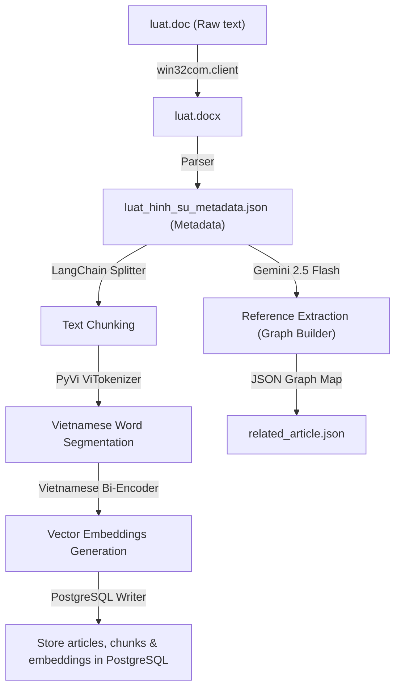
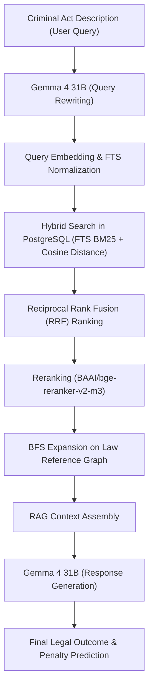

# Vietnamese Legal Judgment Prediction System (LJP-RAG)

A Retrieval-Augmented Generation (RAG) system for predicting legal outcomes and penalties from criminal act descriptions in Vietnamese. The system integrates hybrid search (BM25 + vector cosine distance) and Graph Law Reference Expansion.

---

## Pipeline Architecture

The system consists of two main stages: the Data Ingestion Pipeline and the Inference Pipeline.

### 1. Data Ingestion Pipeline



- **Document Conversion:** Raw `.doc` files are automated and converted to `.docx` format using Microsoft Word Automation (`win32com.client`).
- **Text Chunking:** Article contents are segmented using LangChain's `RecursiveCharacterTextSplitter` to keep the chunk size optimal and under the token limit of the embedding model.
- **Word Segmentation:** Text chunks are segmented into Vietnamese terms using the `pyvi` library (`ViTokenizer`) to format compound words with underscores (e.g., `giáo_viên`, `cố_ý_gây_thương_tích`).
- **Vector Embeddings Generation:** Chunks are converted into 768-dimensional dense vector embeddings using the `bkai-foundation-models/vietnamese-bi-encoder` model.
- **Graph Law Reference Extraction:** The `gemini-2.5-flash` model, using structured JSON output via a Pydantic schema definition, analyzes the batch of law articles to detect cross-references between different articles, saving the mappings to `related_article.json`.
- **Database Storage:** Raw articles, word-segmented chunks, and their vector embeddings are stored in a PostgreSQL database enabled with `pgvector` and Full-Text Search indexes.

---

### 2. Inference Pipeline



- **Query Rewriting:** The natural language query is translated into legal terms in the Vietnamese Penal Code using the `gemma-4-31b-it` model.
- **Normalization & Query Embedding:** The rewritten query is segmented using `pyvi` and vectorized using the `vietnamese-bi-encoder`.
- **Hybrid Search:** 
  - **Full-Text Search (FTS):** Searches for keywords using unaccented terms via `unidecode` and `OR` query logic.
  - **Vector Search:** Calculates the cosine distance between the query vector and chunk embeddings in the database using the `<=>` operator from `pgvector`.
- **Reciprocal Rank Fusion (RRF):** Blends the rankings of BM25 (FTS) and semantic vector search in PostgreSQL to produce the best candidate articles.
- **Neural Reranking:** The cross-encoder `BAAI/bge-reranker-v2-m3` scores the candidate chunks against the user query, selecting the top candidates.
- **Graph Lookup Expansion:** Runs a BFS (Breadth-First Search) on the article reference graph (`related_article.json`) to fetch additional referenced law articles, preventing the omission of related clauses.
- **Response Generation:** The `gemma-4-31b-it` model generates the final legal analysis (violator status, violation acts, charges, aggravating/mitigating factors, and predicted penalty) in Vietnamese based on the query and retrieved context.

---

## Tech Stack

### 1. AI Models & NLP
- **gemma-4-31b-it:** Used for query rewriting and legal judgment generation.
- **gemini-2.5-flash:** Used for structured JSON law graph extraction.
- **bkai-foundation-models/vietnamese-bi-encoder:** Used for generating semantic embeddings.
- **BAAI/bge-reranker-v2-m3:** Used for neural reranking of retrieved candidates.
- **PyVi (ViTokenizer):** Vietnamese word segmentation tool.
- **Unidecode:** ASCII transliterations of Unicode text for Full-Text Search.

### 2. Database & Vector Storage
- **PostgreSQL:** Relational database for storing raw texts and metadata.
- **pgvector:** PostgreSQL extension for storing and performing vector similarity searches.
- **Full-Text Search:** Native PostgreSQL FTS using `tsvector` and `tsquery`.

### 3. Development Libraries
- **PyTorch:** Underlying framework for running deep learning models.
- **Transformers & Sentence-Transformers:** Hugging Face libraries for executing models and tokenizers.
- **LangChain:** Used for recursive text splitting.
- **Psycopg2-binary:** PostgreSQL client interface for Python.
- **Pydantic:** Data validation and structured schema outputs for the Gemini API.

---

## Getting Started

### 1. Requirements
- Python 3.12 or Python 3.13 (Standard).
- PostgreSQL database with `pgvector` enabled.

### 2. Configuration
Create a `.env` file in the root directory:
```env
DB_HOST=localhost
DB_PORT=5433
DB_NAME=rag
DB_USER=postgres
DB_PASSWORD=your_password
GOOGLE_API_KEY=your_gemini_api_key
```

### 3. Installation
Install all dependencies using pip:
```bash
pip install -r requirements.txt
```

### 4. Running the Pipeline
Run the main script using the standard Python environment:
```powershell
py -3.13 main.py
```
